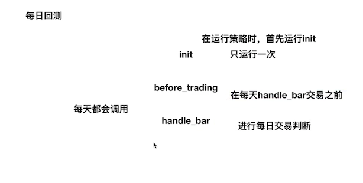
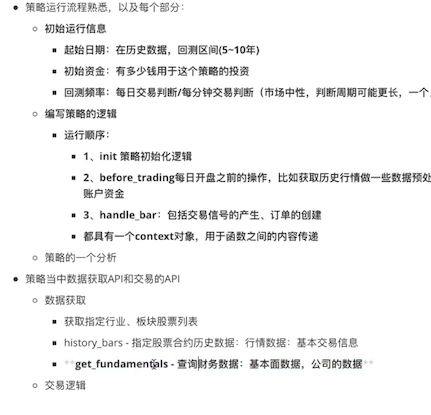

##### 量化交易简介
1. 现代统计学与机器学习的方法
2. 计算机技术
3. 证券投资或者分析方法
4. 用数量模型验证及固化这些规律和策略，然后严格执行
5. 掌握技术：金融策略、挖掘技术、计算机技术

#### 量化交易的分类(米宽平台)
1. 趋势性交易，代表期货CTA. 
2. 市场中性交易,代表 Alapha策略、统计套利。计算机专业出生
3. 高频交易，代表程序化交易
![]!! 策略不可能一直有效

