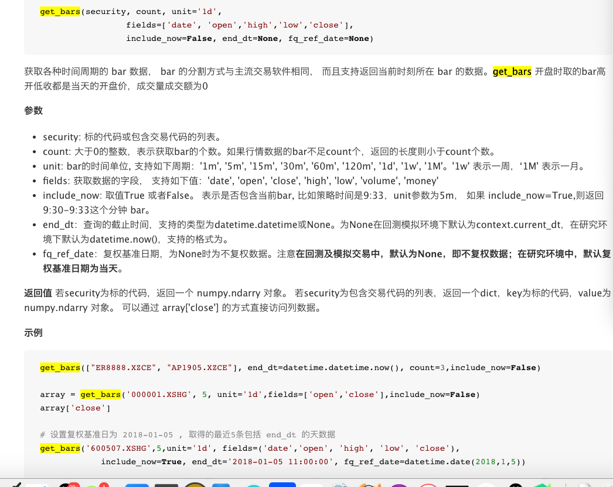

##### 基本框架

````
  写法一：
  def initialize(context):
      run_daily(period,time='every_bar')
      这里是用来写初始化代码的地方,例子中就是选定要交易的股票为平安银行

  def period(context):
      这里是用来写周期循环代码的地方,例子中就是买100股的平安银行
      
  写法二：
  def initialize(context):
      g.security = '000001.XSHE' #g代表全局变量

  def handle_data(context,data):
      这里是用来写周期循环代码的地方,例子中就是买100股的平安银行
````

##### [定时器运行函数](https://www.joinquant.com/help/api/help?name=api_old#%E5%AE%9A%E6%97%B6%E8%BF%90%E8%A1%8C%E5%87%BD%E6%95%B0%E5%8F%AF%E9%80%89)

````
   # 按月运行
    run_monthly(func, monthday, time='09:00', reference_security)
    # 按周运行
    run_weekly(func, weekday, time='09:00', reference_security)
    # 每天内何时运行
    run_daily(func, time='09:00', reference_security)
````

##### [下单函数API](https://www.joinquant.com/help/api/help?name=api#order-method)

````
下单函数：
	order(g.security, 100) #买100股.security，如果为卖的话，可以写成负数
   order函数参数说明：
   		security：代码	
   		amount 交易数量, 正数表示买入, 负数表示卖出
   		style参数决定下的订单是市价单还是限价单，默认是None代表市价单
   		side参数决定是开空单还是多单，默认为多单，股票只能多单，股指期货等其他品类可以开空单
   		pindex参数是在多资金仓位时选择资金仓位的，股票一般用不到
	
	order_target(security,amount)：将股票仓位调整至一定数量，如：
	order_target("000001.XSHE",1000) 表示 如果目前平安银行的持股数量低于1000股就买入，高于就是卖出，不高不低就不动
	
	order_value(security,value)，含义是买卖一定价值量（单位：元）股票 ，如：
	order_value("000001.XSHE",10000) 表示买入10000元的平安银行，如果当前股票市价是10元，则代表买入1000股
	
	order_target_value(security,value)，通过买卖，将股票仓位调整至一定价值量（单位：元），如：
	order_target_value("000001.XSHE",10000) 调整平安银行的持股价值量至10000元 即：如果目前平安银行的持股价值量（按股票市价算）低于10000元就买入，高于就是卖出，不高不低就不动。  
	 		
````

##### [content数据解析，非常重要](https://www.joinquant.com/view/community/detail/04a0251d77b31e782afa0f321c459d10)


````
	应用：计算收益率、止损
	for stk in g.security:
	  order(stk,100)
	  # 获得股票持仓成本
	  cost=context.portfolio.positions[stk].avg_cost
	  # 获得股票现价
	  price=context.portfolio.positions[stk].price
	  # 计算收益率
	  ret=price/cost-1
	  # 如果收益率小于-0.01，即亏损达到1%则卖出股票，幅度可以自己调，一般10%
	  if ret<-0.01:
	      order_target(stk,0)
	      print('触发止损')
````

##### [循环、多股票策略](https://www.joinquant.com/view/community/detail/1d3520aa01c254eabb8220bce032e3dc)

##### [获取典型常用数据](https://www.joinquant.com/view/community/detail/c688e86342b472f380c8fb9fc58eec54) [数据](https://www.joinquant.com/data)
	
* [获取历史行情](https://www.joinquant.com/help/data/index#%E5%8E%86%E5%8F%B2%E8%A1%8C%E6%83%85%E6%95%B0%E6%8D%AE)

	

````
获取沪深300指数信息（没实际意义）：
obj = get_security_info('000300.XSHG')
log.info(obj.display_name)
log.info(obj.start_date)

获取所有指数：
log.info(get_all_securities(['index']))

获取指数中所有个股:
indexs = get_index_stocks('000300.XSHG')# 获取所有沪深300的股票,只返回的代码
set_universe(indexs) #设置为股票池

获取历史行情数据：
history(count, unit, field, security_list=['index_list'], df=True, skip_paused=False, fq='pre')
参数说明：
	count: 数量, 返回的结果集的行数 
	unit: 单位时间长度, 几天或者几分钟, 现在支持’Xd’,’Xm’, X是一个正整数, 分别表示X天和X分钟
	field: 要获取的数据类型, 支持属性里面的所有基本属性.
	security_list: 要获取数据的指数列表
	df: 若是True, 返回[pandas.DataFrame],默认是True.
	skip_paused: 是否跳过不交易日期
	fq: 复权选项: pre前复权  None不复权, 返回实际价格  post后复权
	
````

##### 获取单只个股历史数据，[具体参考](https://www.joinquant.com/view/community/detail/c688e86342b472f380c8fb9fc58eec54)


##### [获取历史数据](https://joinquant.com/help/api/help?name=api_old#get_bars-%E8%8E%B7%E5%8F%96%E5%8E%86%E5%8F%B2%E6%95%B0%E6%8D%AE)，可以同时获取多只个股且可以获取分钟、日线、周线、月线


'''
data = get_bars(security='000001.XSHG', count=100, unit='1w',
                include_now=False, 
                end_dt='2019-07-10', fq_ref_date=None)
'''

##### [获取财务数据](https://www.joinquant.com/help/api/help?name=api_old#get_fundamentals-%E6%9F%A5%E8%AF%A2%E8%B4%A2%E5%8A%A1%E6%95%B0%E6%8D%AE)  [涉及到的财务字段与表](https://www.joinquant.com/help/api/help?name=Stock#%E8%B4%A2%E5%8A%A1%E6%95%B0%E6%8D%AE%E5%88%97%E8%A1%A8)

````
query模板：
	query(表.字段).filter(筛选条件).order_by(排序方法).limit(数量上限)
	
例如：获取上证中流通市值最大的5只票
	
	 #获取上证指数成分股的股票代码
    stcks = get_index_stocks('000001.XSHG')
    q = query(
            # 获取 市值表.股票代码，市值表.流通市值
            valuation.code, valuation.circulating_market_cap
        ).filter(
            #上证指数中过滤
            valuation.code.in_(stocks)
        ).order_by(
            # 排序 按市值从大到小排
            valuation.circulating_market_cap.desc()
            # 数量 上限5条数据
    ).limit(5)
    w = get_fundamentals(q)
    log.info(w)
    
    如上面的valuation表示市值表
    
    # 查询平安银行2014年四个季度的季报, 放到数组中
	q = query(
	        income.statDate,
	        income.code,
	        income.basic_eps,
	        balance.cash_equivalents,
	        cash_flow.goods_sale_and_service_render_cash
	    ).filter(
	        income.code == '000001.XSHE',
	    )
	
	rets = [get_fundamentals(q, statDate='2014q'+str(i)) for i in range(1, 5)]
	
	
	get_fundamentals(q)
	
````


##### [获取行业成份股](https://www.joinquant.com/help/api/help?name=api_old#get_industry_stocks-%E8%8E%B7%E5%8F%96%E8%A1%8C%E4%B8%9A%E6%88%90%E4%BB%BD%E8%82%A1)，[行业概念](https://www.joinquant.com/data/dict/plateData)

````

获取所有农业股：
log.info(get_industry_stocks('A01', date=None))
获取指数个股
indexs = get_index_stocks('000300.XSHG')# 获取所有沪深300的股票,只返回的代码

````

###### [获取个股资金流向](https://www.joinquant.com/help/api/help?name=Stock#%E8%8E%B7%E5%8F%96%E8%82%A1%E7%A5%A8%E8%B5%84%E9%87%91%E6%B5%81%E5%90%91%E6%95%B0%E6%8D%AE)

````
    获取2019-07-11前5天的流向
    money_flow = get_money_flow('300251.XSHE',end_date='2019-07-11',fields=['date','change_pct','net_amount_l','net_amount_m'], count=5)
    log.info(money_flow)
    
    date	日期	
	sec_code	股票代码	
	change_pct	涨跌幅(%)	
	net_amount_main	主力净额(万)	主力净额 = 超大单净额 + 大单净额
	net_pct_main	主力净占比(%)	主力净占比 = 主力净额 / 成交额
	net_amount_xl	超大单净额(万)	超大单：大于等于50万股或者100万元的成交单
	net_pct_xl	超大单净占比(%)	超大单净占比 = 超大单净额 / 成交额
	net_amount_l	大单净额(万)	大单：大于等于10万股或者20万元且小于50万股或者100万元的成交单
	net_pct_l	大单净占比(%)	大单净占比 = 大单净额 / 成交额
	net_amount_m	中单净额(万)	中单：大于等于2万股或者4万元且小于10万股或者20万元的成交单
	net_pct_m	中单净占比(%)	中单净占比 = 中单净额 / 成交额
	net_amount_s	小单净额(万)	小单：小于2万股或者4万元的成交单
	net_pct_s	小单净占比(%)	小单净占比 = 小单净额 / 成交额

````


##### 常用代码

````
# 过滤停牌、退市、ST股票

000300.XSHG 
000016

def paused_filter(security_list):
    current_data = get_current_data()
    security_list = [stock for stock in security_list if not current_data[stock].paused]
    return security_list

def delisted_filter(security_list):
    current_data = get_current_data()
    security_list = [stock for stock in security_list if not '退' in current_data[stock].name]
    return security_list

def st_filter(security_list):
    current_data = get_current_data()
    security_list = [stock for stock in security_list if not current_data[stock].is_st]
    return security_list
    
stockpool = paused_filter(stockpool)# 过滤停牌
stockpool = delisted_filter(stockpool)# 过滤退市
stockpool = st_filter(stockpool)# 过滤ST股票    


    ret = get_fundamentals(q, statDate='2014')
    print(ret.iloc[0]['code'])
    print(list(ret['code']))


current_price = history(1, '1m', 'close', security).iloc[0].iloc[0] 

 KD指标:
	K1, D1 = KD(security, check_date=context.current_dt, N=9, M1=3, M2=3)
	K2, D2 = KD(security, check_date=context.previous_date-datetime.timedelta(days=1),N=9,M1=3,M2=3)
	if  K1[security]>D1[security] and K2[security] <=D2[security]:#金叉
	  ....
	if K1[security]<=D1[security] and K2[security] >D2[security]#死叉 

DKX指标：多空线
    K1, D1 = DKX(security, check_date=context.current_dt, M=10,unit='1w')
    K2, D2 = DKX(security, check_date=context.previous_date-datetime.timedelta(days=1),M=10,unit='1w')

    # 形成死叉，并且目前有头寸,有可卖出股票，则全仓卖出
    if  K1[security]<=D1[security] and K2[security] >D2[security]        
    
    if  K1[stk]>D1[stk] and K2[stk] <=D2[stk]: #金叉
    
    
````

* [向导式框架封装的库函数](https://www.joinquant.com/view/community/detail/990ed90abc51dd87ba84d7b30ab17754)

##### 取前几日换手率排名

````

now_data:获取时间
first_number:开始排名
second_number:截取排名
days:天数

def choose_stock(now_data,first_number,second_number,days=1):
    stock_dict = {}
    for i in range(1,days+1):
        #格式化时间       
        while(1):
            print(i)
            ctime = datetime.datetime.strptime(str(now_data), '%Y-%m-%d')#.timestamp()
            if i > 1:
                dates = ctime + datetime.timedelta(days = -i+1)
            else:
                dates = ctime
            timeArray = time.strptime(str(dates), "%Y-%m-%d %H:%M:%S")
            # 转换成时间戳
            timestamp = int(time.mktime(timeArray))
            timeArray = time.localtime(timestamp)
            otherStyleTime = time.strftime("%Y-%m-%d", timeArray)
            print(otherStyleTime)
            q = query(
                valuation.turnover_ratio,valuation.code
            ).order_by(
                    # 按换手率降序排列
                    valuation.turnover_ratio.desc()
                )
           
            stocks=get_fundamentals_continuously(q,end_date=str(otherStyleTime), count=1) #查询多日的财务数据
            try:
                other_stocks = stocks['turnover_ratio',otherStyleTime]
                
            except:
                i = i + 1
                continue
            stock_dict = other_stocks.to_dict()
            sort_stock = sorted(stock_dict.items(), key=lambda x: x[1], reverse=True)#进行排序
            break;
       
        for index in sort_stock:
            try:
                if g.stock_dict[index[0]]:
                  
                   g.stock_dict[index[0]] = g.stock_dict[index[0]] + index[1]
            except:
              
               g.stock_dict[index[0]] = index[1]
        ##g.all_stock.append(g.stock_dict)
        # if i == days:
    # print(g.stock_dict)
    # exit()
    sort_stock = sorted(g.stock_dict.items(), key=lambda x: x[1], reverse=True)#进行排序
    j = 0
    for index in  sort_stock:
        if j >=first_number and j<=second_number:
            g.really_stock_dict[index[0]] = index[1]
        j = j + 1
    print(g.really_stock_dict)###最终选好的换手率最高的股票
    
````

#### 当前持仓盈亏情况

````
def hold_earn(context):
    hold_s = context.portfolio.positions.keys()
    hold_e = {}
    for stock in hold_s:
        avg_cost = context.portfolio.positions[stock].avg_cost
        current_price = context.portfolio.positions[stock].price
        hold_e[stock] = current_price/avg_cost
    return hold_e
    
````

#### 获取连续涨停股票

````
def get_continuous_limithigh_stocks(context,count=10,end_date='2019-6-7'):
    #count = 10#获取当前日期前10个交易日的数据
    #end_date = datetime.datetime.now().strftime('%Y-%m-%d')#获取当前日期
    stocks = list(get_all_securities(['stock']).index)#获取所有股票代码
    high_limit_stocks = {}
    is_st = get_extras('is_st',stocks, start_date=None, end_date=end_date, df=False, count=1)#获取st股票
    stocks_value = get_price(stocks, start_date=None, end_date=end_date, frequency='daily', fields=['close', 'volume', 'high_limit', 'paused'], skip_paused=False, fq='pre', count=count)
    #获取股票数据
    for stock in stocks:
        high_limit_continous_count = 0
        for i in range(count):
            if stocks_value['close'][stock][count - 1 - i] == stocks_value['high_limit'][stock][count - 1 - i]:
                high_limit_continous_count = high_limit_continous_count + 1
            else:
                #涨停板+非停牌+非st
                if high_limit_continous_count != 0 and not stocks_value['paused'][stock][count - 1] and not is_st[stock][0]:
                    high_limit_stocks[stock] = high_limit_continous_count
                break
    return high_limit_stocks
````

#### [MACD底背离](https://www.joinquant.com/algorithm/apishare/get?apiId=f93610963d769c985d15f156552a7115) [或者](https://www.joinquant.com/algorithm/apishare/get?apiId=6c876b479516bad9267ef49af82a11e6)

````

def filter_vmacd(stocklist):
    
    returnStock =[];
    
    for stock in stocklist:
        
        fast = 12
        slow = 26
        sign =  9
        rows = (fast + slow + sign) * 5
        suit = {'dif':0, 'dea':0, 'macd':0, 'gold':False, 'dead':False}
        grid = attribute_history(stock, rows, fields=['vol']).dropna()
        try:
            grid['dif'], grid['dea'], grid['macd'] = tl.MACD(grid['vol'].values, fast, slow, sign)
            grid = grid.dropna()
            # 底背离----------------------------------------------------------------
            mask = grid['macd']>0
            mask = mask[mask==True][mask.shift(1)==False]
          
            #key3 = mask.keys()[-3]
            key2 = mask.keys()[-2]
            key1 = mask.keys()[-1]
            if grid.vol[key2]>grid.vol[key1] and \
                           grid.dif[key2]<grid.dif[key1]<0 and \
                           grid.macd[-2]<0<grid.macd[-1]:
                returnStock.append(stock);
        except:
            pass
    return returnStock
    

def doDecide(stock):
    fast = 12
    slow = 26
    sign =  9
    rows = (fast + slow + sign) * 5
    suit = {'dif':0, 'dea':0, 'macd':0, 'gold':False, 'dead':False}
    grid = attribute_history(stock, rows, fields=['close']).dropna()
    try:
        grid['dif'], grid['dea'], grid['macd'] = talib.MACD(grid['close'].values, fast, slow, sign)
        grid = grid.dropna()
        # 底背离----------------------------------------------------------------
        mask = grid['macd']>0
        mask = mask[mask==True][mask.shift(1)==False]
        key2 = mask.keys()[-2]
        key1 = mask.keys()[-1]
        suit['gold'] = grid.close[key2]>grid.close[key1] and \
                       grid.dif[key2]<grid.dif[key1]<0   and \
                       grid.macd[-2]<0<grid.macd[-1]
        # 顶背离----------------------------------------------------------------
        mask = grid['macd']<0
        mask = mask[mask==True][mask.shift(1)==False]
        key2 = mask.keys()[-2]
        key1 = mask.keys()[-1]
        suit['dead'] = grid.close[key2]<grid.close[key1] and \
                       grid.dif[key2]>grid.dif[key1]>0   and \
                       grid.macd[-2]>0>grid.macd[-1]
    except:
        pass
    return suit   
    
````
##### 过滤均线多头的个股:

````
 #选取日和周均线多头排列的股票
from jqlib.technical_analysis import MA
def filter_duotou_list(securitys,date,unit1='1d',unit2 = None):
    sel_list = []
    ma5_df = pd.Series(MA(securitys,date,timeperiod=5,unit=unit1))  #include_now为True,计算的MA包含当前最新价
    ma10_df = pd.Series(MA(securitys,date,timeperiod=10,unit=unit1))
    ma20_df = pd.Series(MA(securitys,date,timeperiod=20,unit=unit1))
    ma30_df = pd.Series(MA(securitys,date,timeperiod=30,unit=unit1))
    ma60_df = pd.Series(MA(securitys,date,timeperiod=60,unit=unit1)) 
    sel_list = list(set(ma5_df[(ma5_df>ma10_df) & (ma10_df > ma20_df) & (ma20_df > ma30_df) & (ma30_df > ma60_df)].index))  
    if unit2 is not None:
        ma5_df = pd.Series(MA(sel_list,date,timeperiod=5,unit=unit2))  #include_now为True,计算的MA包含当前最新价
        ma10_df = pd.Series(MA(sel_list,date,timeperiod=10,unit=unit2))
        ma20_df = pd.Series(MA(sel_list,date,timeperiod=20,unit=unit2))
        ma30_df = pd.Series(MA(sel_list,date,timeperiod=30,unit=unit2))
        ma60_df = pd.Series(MA(sel_list,date,timeperiod=60,unit=unit2)) 
        sel_list = list(set(ma5_df[(ma5_df>ma10_df) & (ma10_df > ma20_df) & (ma20_df > ma30_df) & (ma30_df > ma60_df)].index))  
    
    return sel_list
````

##### 上阴线


````
 #bar 最高价和收盘价比值大于2%, 上阴线确认
def is_upline_dead(context, stock, h):
    flag = False 
    for num in range(1,5):
        if (h['high'][-num] - h['open'][-num]) / h['open'][-num] > 0.02 :
            flag = True
            break
    return flag
    
````

###### 龙头 能源

````
上证龙头 000065.XSHG
中证龙头 000960.XSHG
深证龙头 399653.XSHE
中证能源 000928.XSHG

    # all = get_all_securities(['index'])
    # log.info(all.columns.values.tolist())
    # for i in range(len(all)):
    #     data = all.iloc[i]
    #     log.info(data)
````

#### [技术分析指标](https://joinquant.com/data/dict/technicalanalysis)